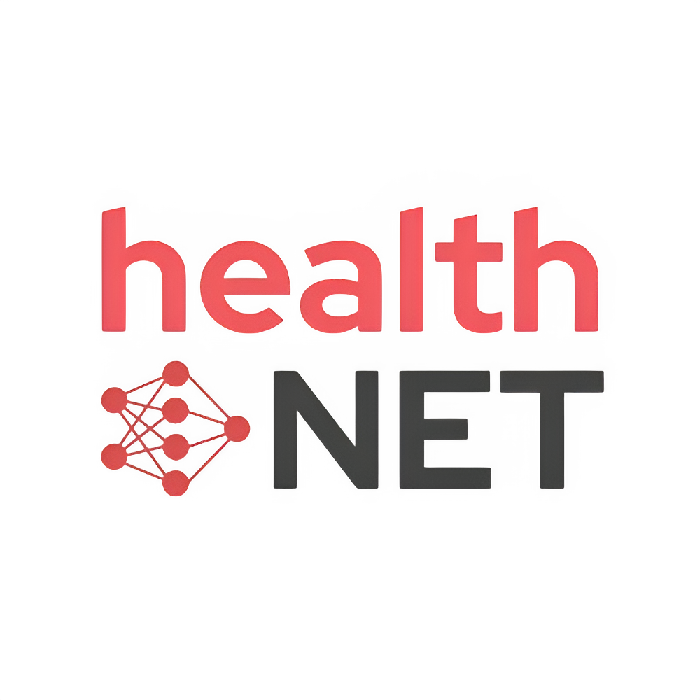

# healthNET



healthNET lets hospitals and other healthcare organizations collaboratively train AI models without sharing raw data. By keeping data decentralized and only exchanging model updates, the platform improves model quality while respecting strict privacy regulations.

## TL;DR

Due to strict privacy laws and regulations around medical data, hospitals face issues developing AI models and data-driven technology, as they cannot share or access data from other hospitals.\
With healthNET, hospitals and other medical clients can collaboratively train AI models with a larger pool of data, all without ever exposing the raw data. We built this through an edge computing model with federated learning, allowing each user to individually update the aggregated model locally. Our approach preserves privacy and security, all while improving AI performance across institutions.

## Inspiration

The healthcare domain benefits from advanced data analytics. According to RBC Capital Markets, approximately 30% of the world's data volume is being generated by the healthcare industry. This data can and should be mobilized to improve patient outcomes.\
Modern AI models for healthcare require large amounts of patient data to be accurate. Hospitals, clinics, and research institutions often cannot share patient data due to privacy laws and ethical concerns. This makes it challenging to train and deploy machine learning models on shared datasets. Unfortunately, models that are trained only on a single institution’s data are prone to being more biased and less accurate. Thus, health institutions are unable to maximally benefit from the large amounts of existing data.

## What It Does

Enter healthNET: an application that enables health institutions to train neural networks without direct data sharing. healthNET utilizes federated learning, a machine learning technique that trains a model collaboratively across multiple devices without centralizing raw data, prioritizing user privacy and data security. healthNET empowers users to benefit from large amounts of existing data without sharing their data and worrying about communication overhead.

## How We Built It

In traditional machine learning, data must be centralized into a single dataset that the model is trained on. In federated learning, instead of bringing data to the model, the model is brought directly to the data.

A federated learning system comprises node servers and an aggregator server.

- **Node servers**: represent healthcare entities like hospitals. Each node retains total ownership of its dataset, which is never shared externally.  
- **Aggregator server**: coordinates training across the nodes, maintains the global model, distributes it to nodes, and aggregates the returned updates (weights, gradients, etc.) to improve the global model.

We use the FedAVG strategy, which averages model weights coming from every node. The backend is built with FastAPI and Flower, while the frontend uses React. Thanks to HackUMass sponsor Vultr for providing the cloud credits powering our aggregator server.

---

## Local Development

### 1. Python dependencies

We manage Python tooling with [`uv`](https://github.com/astral-sh/uv). Run the sync step whenever dependencies change:

```bash
uv sync
```

This installs everything listed in `pyproject.toml`/`uv.lock` into your local environment.

### 2. Environment variables

Copy the example environment file and adjust it for your setup:

```bash
cp server/.env.example server/.env
```

Key fields:

- `FASTAPI_HOST` – use `127.0.0.1` for local-only work or `0.0.0.0` when hosting remotely
- `FASTAPI_PORT` – backend service port (defaults to `8002`)
- `PUBLIC_DASHBOARD_DOMAIN` – URL the frontend should use to reach the backend (e.g., `http://localhost:8000` in local dev)

Update these values any time you change where the backend runs.

### 3. Start the backend

```bash
cd server
python main.py
```

This launches the FastAPI-powered aggregator server.

### 4. Start the frontend

```bash
cd client
npm install
npm run dev
```

Visit the printed Vite URL (usually `http://localhost:5173`) to use the dashboard.

---

## Running the Federated Workflow

1. Make sure the backend (`python main.py`) is running.  
2. Launch individual node clients (each hospital) with the appropriate dataset partition.  
3. Observe the aggregated training progress in the frontend dashboard.

---

## Visit our Hackathon Devpost

[https://devpost.com/software/healthnet-h5o0dx](https://devpost.com/software/healthnet-h5o0dx)